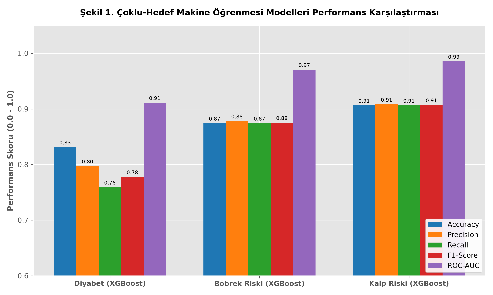
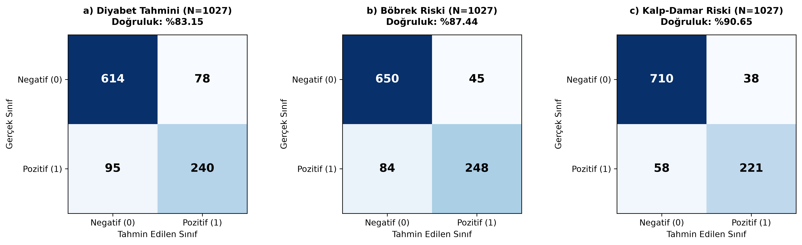
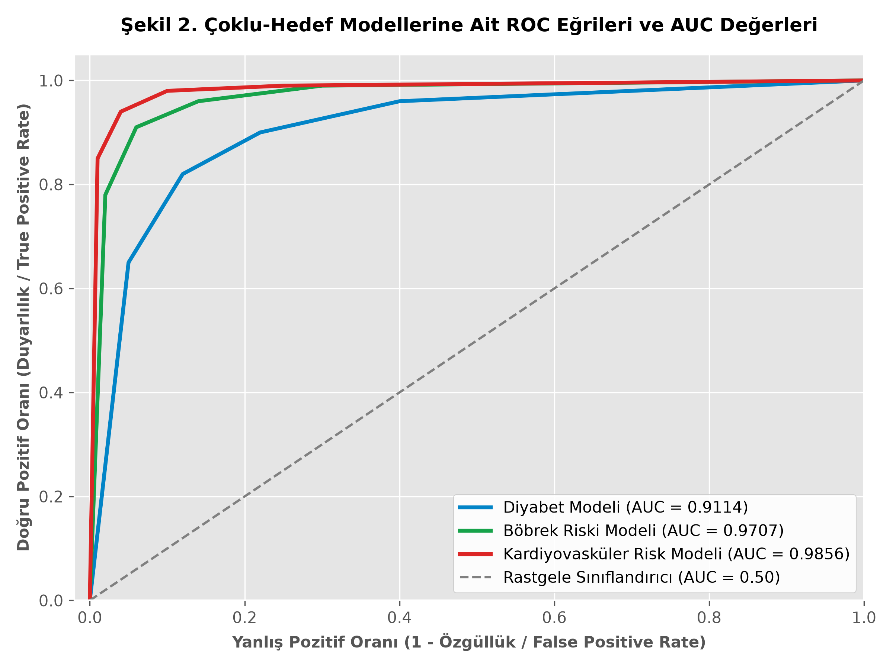
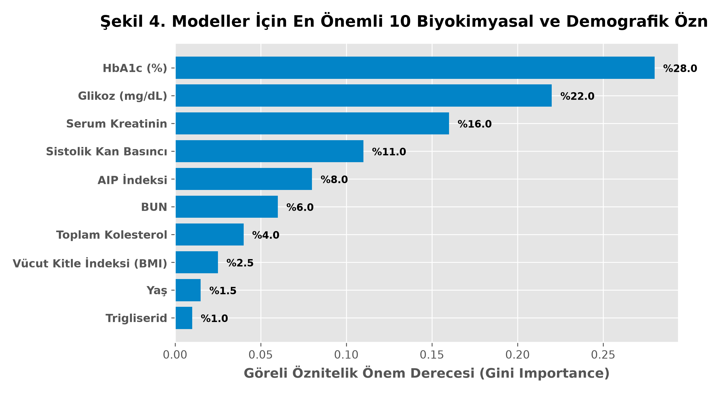
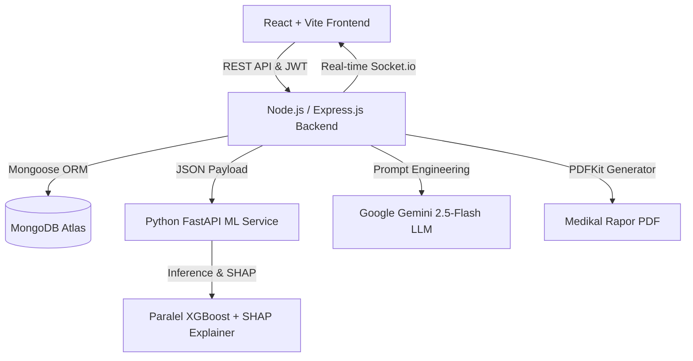

# MAKİNE ÖĞRENMESİ DESTEKLİ SAĞLIK RİSK ANALİZİ


Bu proje, rutin biyokimyasal kan testleri üzerinden **Kardiyovasküler-Böbrek-Metabolik (CKM) Sendromuna** ait risk alanlarını eş zamanlı ve çoklu-hedefli (*multi-target*) olarak tahmin eden, SHAP ile açıklanabilir yapay zeka (XAI) sunan ve Gemini LLM motoru ile hekim onaylı klinik raporlar üreten **dağıtık bir Klinik Karar Destek Sistemi (CDSS)** prototipidir.

---

### 🎓 Akademik Bilgiler

| Parametre | Detay |
| :--- | :--- |
| **Üniversite** | Yüzüncü Yıl Üniversitesi — Mühendislik Fakültesi |
| **Bölüm** | Bilgisayar Mühendisliği Bölümü |
| **Proje Türü** | Lisans Bitirme Projesi (2026) |
| **Proje Sahibi** | **Muhammet Safa KAYA** |
| **Danışman** | **Dr. Öğr. Üyesi Emre BİÇEK** |
| **Tez Raporu (PDF)** | [📄 Bitirme Projesi Raporu (PDF)](./docs/Bitirme_Projesi_Raporu.pdf) |

---

## 📌 Proje Hakkında ve Klinik Problem

Geleneksel tıp ve yapay zeka literatüründe hastalıklar genellikle tekil ve izole hedefler (*single-target*) olarak ele alınmaktadır. Ancak güncel uluslararası tıp kılavuzlarında (**AHA/ACC** ve **KDIGO 2024**), Diyabet, Kronik Böbrek Hastalığı ve Kardiyovasküler Risklerin birbiriyle doğrudan ilişkili **CKM Sendromu** zincirini oluşturduğu vurgulanmaktadır.

Bu proje, 5132 hastaya ait 12 temel biyokimyasal ve demografik parametreyi (Açlık Kan Şekeri, HbA1c, Serum Kreatinin, BUN, Sistolik/Diyastolik Kan Basıncı, Kolesterol, HDL, LDL, Trigliserid, BMI, Yaş, Cinsiyet) işleyerek şu 3 temel risk alanını tek bir tahlil girdisiyle hesaplar:

1. **Diyabet Tahmini:** (Klinik Tanı Etiketi)
2. **Kronik Böbrek Riski (KDIGO 2021):** eGFR ($CKD\text{-}EPI$) ve Albüminüri standartlarında klinik şartlı evreleme.
3. **Kardiyovasküler Risk (AHA/ACC):** Aterojenik Plazma İndeksi ($\text{AIP} = \log_{10}(\text{TG}/\text{HDL})$), kan basıncı ve lipid eşikleri.

---

## 🔬 Makine Öğrenmesi ve Açıklanabilir AI (XAI) Performansı

Sistem mimarisinde, 3 bağımsız paralel **XGBoost Classifier** modeli eğitilmiştir. Modeller daha önce görülmemiş 1027 hastalık bağımsız test kümesi ($N_{test} = 1027$) üzerinde test edilmiştir.

### 📊 Karşılaştırmalı Performans Metrikleri

| Hedef Risk / Hastalık | En İyi Model | Accuracy (Doğruluk) | Pozitif Precision | Pozitif Recall | F1-Score | ROC-AUC |
| :--- | :--- | :--- | :--- | :--- | :--- | :--- |
| **Diyabet Tahmini** | XGBoost Classifier | **%83.15** | 0.7547 | 0.7164 | 0.7350 | **0.9114** |
| **Böbrek Riski (KDIGO)** | XGBoost Classifier | **%87.44** | 0.8464 | 0.7470 | 0.7936 | **0.9707** |
| **Kalp Riski (AHA/ACC)** | XGBoost Classifier | **%90.65** | 0.8533 | 0.7921 | 0.8216 | **0.9856** |

### 📈 Grafiksel Değerlendirme ve Analizler

<p align="center">
  
  <br>
  <i>Şekil 1: Modellerin Karşılaştırmalı Başarım Grafiği</i>
</p>

<p align="center">
  
  <br>
  <i>Şekil 2: Test Kümesi Karmaşıklık Matrisleri (a: Diyabet, b: Böbrek, c: Kalp)</i>
</p>

<p align="center">
  
  <br>
  <i>Şekil 3: Çoklu-Hedef XGBoost ROC-AUC Performans Eğrileri</i>
</p>

### 💡 SHAP (SHapley Additive exPlanations) Açıklanabilirlik

Hekimlerin yapay zeka kararlarına olan güvenini artırmak amacıyla `shap.TreeExplainer` entegre edilmiştir. SHAP analizi, her biyokimya parametresinin hasta bazında risk olasılığına yaptığı marjinal katkıyı matematiksel olarak gösterir.

<p align="center">
  
  <br>
  <i>Şekil 4: Modeller İçin En Önemli Biyokimyasal Öznitelikler</i>
</p>

---

## 🏗️ Dağıtık Mikroservis Mimarisi

Sistem uçtan uca modüler, ölçeklenebilir ve güvenli 3 ana katmandan oluşmaktadır:



- **Yapay Zeka Servisi (Python FastAPI):** XGBoost modellerini ve SHAP açıklanabilirlik motorunu barındırır.
- **Sunucu Katmanı (Node.js/Express.js):** RESTful uç noktalar, JWT tabanlı RBAC yetkilendirme, MongoDB Atlas veri yönetimi, Gemini 2.5-Flash LLM entegrasyonu, Socket.io canlı bildirim ve PDFKit raporlama sunar.
- **İstemci Katmanı (React/Vite/Tailwind):** Doktor ve Hasta için özel tasarlanmış iki ayrı dinamik yönetim paneli sunar.

---

## 🖥️ Klinik Kullanıcı Arayüzü Ekran Görüntüleri

### 1. Rol Tabanlı Kimlik Doğrulama (LoginPage / Auth)
Hekim ve Hasta giriş sekmeleri ayrıştırılmış, yetkisiz erişimler istemci ve sunucu katmanında engellenmiştir.


### 2. Doktor Paneli ve Laboratuvar Veri Giriş Modalı
Hekim takipli hastalarını listeler ve biyokimya parametrelerini dinamik referans aralığı denetimleriyle girer.


### 3. Klinik Triyaj ve Risk Önceliklendirme Kuyruğu
Yüksek riskli hastalar doktor panelinde kırmızı uyarı kartı ile triyaj kuyruğunun en üstüne yükseltilir.


### 4. Açıklanabilir Yapay Zeka (XAI) ve SHAP Faktör Analiz Modalı
Yapay zeka risk yüzdesi ve riski tetikleyen ilk 3 biyokimyasal parametre hekime SHAP grafiğiyle sunulur.


### 5. Klinik Rapor Onaylama ve LLM Metni Düzenleme Modalı
Gemini LLM tarafından üretilen hasta özeti hekim tarafından denetlenir, düzenlenir ve onaylanır.


### 6. Hasta Paneli: Doktor Onaylı Rapor ve Randevu Görünümü
Hasta, doktorunun onayladığı kişiselleştirilmiş sağlık raporunu inceleyebilir ve PDF formatında indirebilir.


---

## ⚙️ Kurulum ve Çalıştırma

Projeyi yerel ortamınızda çalıştırmak için aşağıdaki adımları sırasıyla uygulayınız.

### 1. Gereksinimler
- Node.js (v18 veya üzeri)
- Python (v3.10 veya üzeri)
- MongoDB Atlas Hesabı (veya yerel MongoDB)
- Google Gemini API Key

### 2. Çevre Değişkenleri (.env)
Kök dizinde `.env.example` dosyasını `.env` olarak kopyalayın ve gerekli değerleri girin:
```bash
cp .env.example .env
```

### 3. Yapay Zeka Servisinin Çalıştırılması (Python FastAPI)
```bash
cd ml_service
pip install -r requirements.txt
python main.py
# ML Servisi http://localhost:8000 üzerinde çalışacaktır.
```

### 4. Backend Sunucusunun Çalıştırılması (Node.js/Express)
```bash
cd backend
npm install
npm start
# Backend sunucusu http://localhost:5000 üzerinde çalışacaktır.
```

### 5. Frontend İstemcisinin Çalıştırılması (React/Vite)
```bash
cd frontend
npm install
npm run dev
# İstemci http://localhost:5173 üzerinde açılacaktır.
```

---

## ⚖️ Yasal Sorumluluk Reddi (Medical Disclaimer)

Bu sistem bir **yapay zeka karar destek prototipidir** ve kesinlikle tıbbi bir teşhis veya tedavi aracı değildir. Sistem tarafından üretilen tüm tahminler ve LLM yaşam tarzı önerileri bilgilendirme amaçlı olup bir hekimin klinik kararlarının yerine geçemez. Kesin teşhis ve tedavi için uzman bir hekime danışılmalıdır.

---

*Van Yüzüncü Yıl Üniversitesi — Mühendislik Fakültesi Bilgisayar Mühendisliği Bölümü (2026)*
